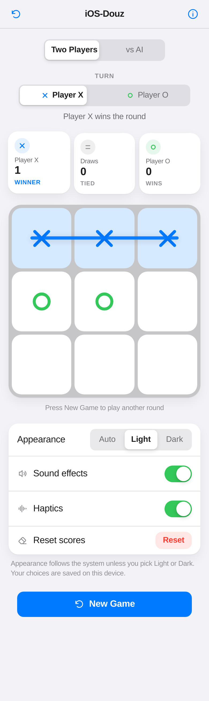
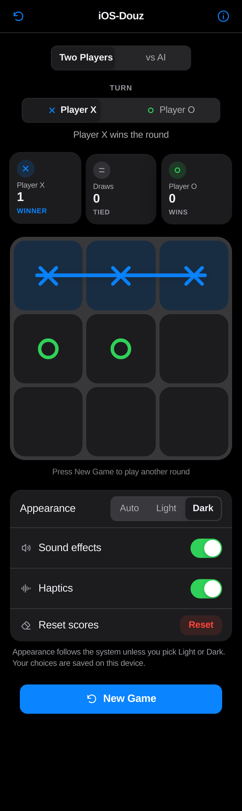

# iOS-Douz

[](https://developeramiri.github.io/iOS-Douz/)
[](LICENSE)
[](#)
[](https://github.com/DeveloperAmiri/iOS-Douz/actions/workflows/ci.yml)

**A classic two-player Tic-Tac-Toe game that looks and feels like a native iOS app.**

No frameworks, no build step, no dependencies — just HTML, CSS and JavaScript.
Clone it, open `index.html`, and play.

> **Live demo:** `https://developeramiri.github.io/iOS-Douz/`
> This repository deploys its own demo. For a fork, replace the username as
> described in [Deploy to GitHub Pages](#deploy-to-github-pages).

| Light | Dark |
| :---: | :---: |
|  |  |

*Desktop width shown in `docs/screenshot-desktop.png`, full icon sheet in
[`assets/icons/preview.html`](assets/icons/preview.html).*

---

## Contents

- [Features](#features)
- [Play the game](#play-the-game)
- [Project structure](#project-structure)
- [Design system](#design-system)
- [Accessibility](#accessibility)
- [Development](#development)
- [Deploy to GitHub Pages](#deploy-to-github-pages)
- [Contributing](#contributing)
- [License](#license)

---

## Features

| Area | What you get |
| --- | --- |
| **Gameplay** | Classic 3×3 Tic-Tac-Toe — two players on one device *or* versus the built-in AI; X always opens, all 8 winning lines detected, draw detection |
| **AI opponent** | Three real algorithms: uniform random (Easy), win–block heuristic (Medium), and full-depth **minimax with alpha–beta pruning** (Hard, unbeatable). You can play as X or O |
| **Score** | Persistent scoreboard (X wins, draws, O wins) saved in `localStorage` |
| **Appearance** | Auto / Light / Dark segmented control, follows `prefers-color-scheme`, choice remembered between visits |
| **Motion** | Spring-eased mark reveal, animated winning line, bouncing score counter, sheet and alert transitions |
| **Sound & haptics** | Tiny Web Audio blips (no audio files) and Vibration API haptics, both switchable |
| **Controls** | Hand-built iOS switch, segmented control, grouped settings list, `UIAlertController`-style dialog, bottom sheet, translucent navigation bar with `backdrop-filter` |
| **Icons** | 13 icons drawn from scratch as inline SVG in the SF Symbols language — uniform 1.75 stroke, rounded caps, `currentColor` |
| **Responsive** | Mobile-first, works from 320 px phones up to desktop |
| **Accessibility** | Keyboard play with arrow keys, `aria-live` announcements, focus trapping in dialogs, `role="switch"`, WCAG AA contrast |

## Play the game

1. Download or clone this repository.
2. Open `index.html` in any modern browser.

That is the whole installation process. There is no build step and no server
requirement — the game also works from the `file://` protocol.

```bash
git clone https://github.com/DeveloperAmiri/iOS-Douz.git
cd iOS-Douz
open index.html        # macOS
# xdg-open index.html  # Linux
# start index.html     # Windows
```

Prefer a local server? Any static server works:

```bash
python3 -m http.server 8000
# then visit http://localhost:8000
```

### How to play

- Pick the opponent at the top: **Two Players** shares one device, **vs AI**
  plays the computer. Against the AI you also choose its difficulty and
  whether you play X or O.
- Tap (or focus with Tab and press Enter) any empty square to place your mark.
- Players alternate: **X** first, then **O**.
- Three marks in a row, column or diagonal wins the round.
- **New Game** clears the board but keeps the score. **Reset** in the settings
  list clears the score after a confirmation dialog.
- Arrow keys move the focus around the board, so the whole game is playable
  without a mouse.

## Project structure

```
iOS-Douz/
├── index.html              Markup, inline SVG favicon, theme bootstrap
├── css/
│   └── style.css           Design tokens (light + dark) and every component
├── js/
│   ├── icons.js            Hand-made SF Symbols-style icon set
│   ├── game.js             Pure game logic — no DOM, unit tested
│   ├── ai.js               AI opponent: minimax + alpha–beta, heuristic, random
│   └── ui.js               Rendering, dialogs, theme, sound, persistence
├── assets/
│   └── icons/
│       └── preview.html    Visual reference sheet for the icon set
├── tests/
│   ├── game.test.js        Node test suite for the game logic
│   └── ai.test.js          Node test suite for the AI (never-loses proof included)
├── .nojekyll               Stops GitHub Pages from ignoring `_`-prefixed files
├── .gitignore
├── LICENSE                 MIT
└── README.md
```

Every internal path is **relative** (`css/style.css`, `js/ui.js`, …), so the
game works from a domain root as well as from a sub-path such as
`https://username.github.io/iOS-Douz/`.

## Design system

All colours are semantic CSS custom properties defined once for the light
appearance and overridden under `[data-theme="dark"]`. No component hard-codes
a hex value.

| Token | Light | Dark | Used for |
| --- | --- | --- | --- |
| `--color-primary` | `#007AFF` | `#0A84FF` | Interactive elements, player **X** |
| `--color-destructive` | `#FF3B30` | `#FF453A` | Reset actions |
| `--color-success` | `#34C759` | `#30D158` | Player **O**, winning line |
| `--color-label` | `#1C1C1E` | `#F2F2F7` | Primary text (never pure black/white) |
| `--color-tertiary-text` | `#6B6B70` | `#AEAEB2` | Body-size secondary text (AA) |
| `--color-secondary-text` | `#8E8E93` | `#98989F` | Captions and footnotes |
| `--color-background` | `#F2F2F7` | `#000000` | Page |
| `--color-surface` | `#FFFFFF` | `#1C1C1E` | Cards, squares, alerts, sheet |
| `--color-fill-secondary` | `rgba(120,120,128,.16)` | `rgba(120,120,128,.32)` | Switch track, segmented control |
| `--color-separator` | `rgba(60,60,67,.18)` | `rgba(84,84,88,.6)` | 0.5 px hairlines |

In dark mode the layers are separated by lightness rather than by shadow, and
the semantic colours are the darker iOS variants so they do not glare.

**Typography** uses the system stack
(`-apple-system, BlinkMacSystemFont, "SF Pro Display", "SF Pro Text", …`) at
rem sizes, so a browser font-size change scales the whole interface — the web
equivalent of iOS Dynamic Type.

**Motion** uses spring-like cubic-béziers (`cubic-bezier(0.34, 1.56, 0.64, 1)`)
for overshoot and is disabled automatically under `prefers-reduced-motion`.

## Accessibility

- **Never colour alone.** X and O differ by shape as well as colour, the
  winning player is announced in text ("winner"), and every state change is
  pushed to an `aria-live` region.
- **Keyboard.** All controls are real `<button>` elements, arrow keys navigate
  the board, Tab moves through the settings, and `Escape` closes dialogs with
  focus trapped inside them.
- **Touch targets.** Every interactive element is at least 44×44 px, even when
  its visual size is smaller (the 51×31 px switch has a 44 px tall hit area).
- **Contrast.** Body text meets WCAG AA against both backgrounds; large-text
  and non-text elements meet AA as well.
- **Semantics.** `role="switch"` with `aria-checked` on the toggles,
  `role="radiogroup"` on the appearance control, `role="alertdialog"` with
  `aria-modal` on the result dialog.

## Development

The game logic is deliberately DOM-free, so it runs under plain Node.js.

```bash
node tests/game.test.js   # 36 checks — rules, wins, draws, scores, undo
node tests/ai.test.js     # 15 checks — tactics, and hard AI never losing
```

Each suite prints its assertions and ends with `All N checks passed.`

There is also an optional end-to-end smoke test that drives the real page in
headless Chromium (Playwright is a development-only dependency and is never
shipped):

```bash
npm install --no-save playwright
npx playwright install chromium
node tests/browser.smoke.mjs   # 45 checks: boot, play, AI mode, theme, a11y, screenshots
```

## Deploy to GitHub Pages

GitHub Pages serves the repository as a static site for free at
`https://YOUR-USERNAME.github.io/iOS-Douz/`. Follow these steps in order.

### 1. Get the code into a public repository

**Option A — fork this project** (easiest if you found it on GitHub):

1. Open the repository page and click **Fork**.
2. Keep the default name `iOS-Douz` and make sure **Public** is selected.
3. Click **Create fork**.

**Option B — upload your own copy:**

```bash
cd iOS-Douz
git init
git add .
git commit -m "Add iOS-Douz: an iOS-styled Tic-Tac-Toe game"
git branch -M main
git remote add origin https://github.com/DeveloperAmiri/iOS-Douz.git
git push -u origin main
```

Create the empty repository on <https://github.com/new> first (no README, no
license file, so the push is not rejected). The repository **must be public**
for free GitHub Pages hosting.

### 2. Open the Pages settings

In your repository, go to **Settings → Pages**
(direct URL: `https://github.com/YOUR-USERNAME/iOS-Douz/settings/pages`).

### 3. Choose the source

Under **Build and deployment → Source** select:

| Setting | Value |
| --- | --- |
| Source | `Deploy from a branch` |
| Branch | `main` |
| Folder | `/ (root)` |

### 4. Save and wait

Click **Save**. The first build takes one to three minutes. When it finishes
you get the banner *“Your site is live at …”* and the address:

```
https://YOUR-USERNAME.github.io/iOS-Douz/
```

### 5. Update the demo link

Replace `YOUR-USERNAME` in the badge and the **Live demo** line at the top of
this README, then commit:

```bash
git add README.md
git commit -m "docs: point the live demo badge at the deployed site"
git push
```

### Notes

- The `.nojekyll` file in the repository root is intentional: it tells GitHub
  Pages to serve the files as they are instead of running them through Jekyll,
  which would skip files and folders whose names start with `_`.
- Because every path in the project is relative, no `base` configuration is
  needed for the `/iOS-Douz/` sub-path.
- Later changes go live automatically after each push to `main`.
- Optional: add a custom domain under **Settings → Pages → Custom domain**, or
  rename the repository to `YOUR-USERNAME.github.io` to serve it at the root
  domain instead of a sub-path.

## Contributing

Contributions are welcome. A few conventions this project follows:

- Vanilla HTML, CSS and JavaScript only — no frameworks, bundlers or CDNs.
- Colours are added as semantic custom properties in `css/style.css`, never
  inline.
- New icons are drawn as 24×24 inline SVG with a 1.75 stroke and rounded caps,
  and added to `js/icons.js`.
- Logic that can live without the DOM belongs in `js/game.js`, with a test in
  `tests/game.test.js`.
- Comments, UI copy, file names and commit messages are in English.

Suggested commit style: `feat: …`, `fix: …`, `docs: …`, `style: …`, `test: …`.

## License

Released under the [MIT License](LICENSE).
